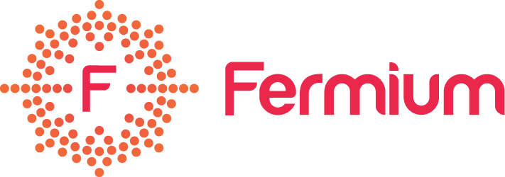
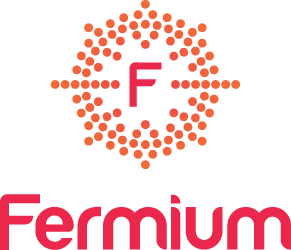
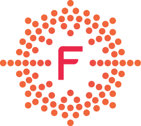

# Logo

The Logo represents the atomic configuration of the element [Fermium](https://en.wikipedia.org/wiki/Fermium). Each dot represents one of [100](https://en.wikipedia.org/wiki/Atomic_number) electrons. 

The name of the element Fermium (as well as the name of our company) is in honour of the Italian scientist [Enrico Fermi](https://en.wikipedia.org/wiki/Enrico_Fermi).

The vertical version or the atom (symbol) can be used if needed.

The main company color is Amaranth ([#eb274a](http://www.colorhexa.com/eb274a)) and main font is [Roboto Light](https://fonts.google.com/specimen/Roboto).

---

Extended guidelines (2015 logo): [Download](https://gitcdn.xyz/repo/fermiumlabs/presskit/master/Logo/Guidelines.pdf)

The extended guidelines still apply to the 2020 Logo.

---

### Credits

The Logo has been originally designed by [Serena Vinciguerra](http://www.serenavinciguerra.it)

Adapted from "Fermium LABS" to "Fermium" by [Zanik Design](https://www.facebook.com/zanikdesign/)

---

